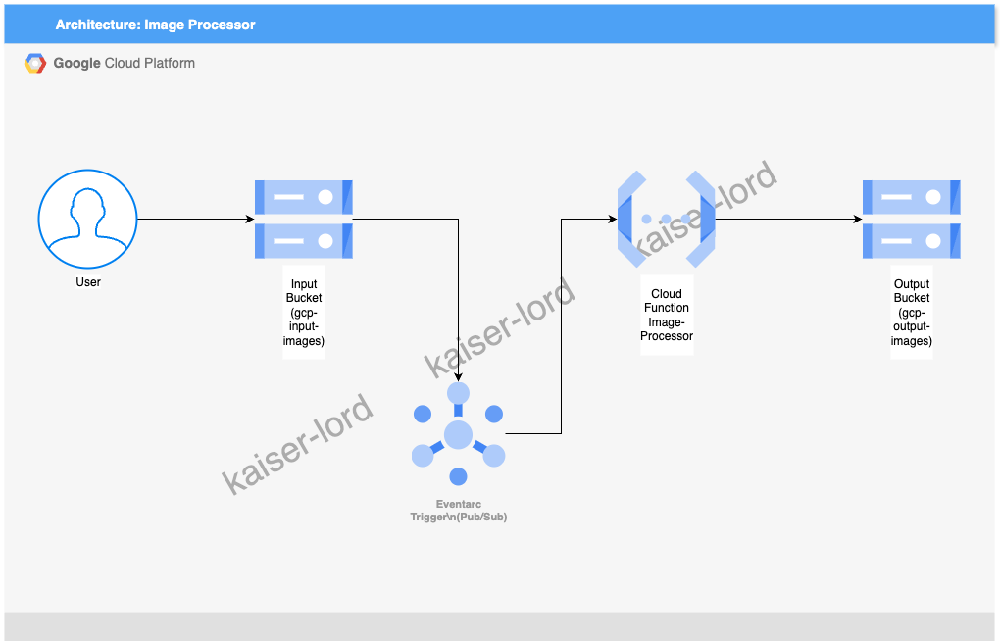

# Automated Image Processing Pipeline with Cloud Functions and Cloud Storage
*A cloud engineering project by kaiser-lord*

---

## 📘 Overview
This project builds an event-driven, serverless pipeline on Google Cloud Platform (GCP) that automatically processes images uploaded to a Cloud Storage bucket

---

## 🎯 Objectives

- Develop a serverless image processing pipeline, to automatically process images uploaded to a bucket  
- Implement serverless architecture, and automation
- Make extensive use of Google Cloud services

---

## ☁️ Architecture
 The application uses a serverless architecture with Cloud Functions, and Cloud Storage buckets to store uploaded and processed images respectively

- **User**: Uploads images to the input bucket via browser or CLI.
- **Input Bucket**: Stores uploaded images, triggering the Cloud Function via Eventarc.
- **Cloud Function**: Resizes images to 200x200 pixels using Pillow.
- **Output Bucket**: Stores processed thumbnails.

**Components:**
| Layer | Services / Tools | Description |
|-------|------------------|-------------|
| Layer                      | Services / Tools                                      | Description                                      
| **Compute**                | **Cloud Functions (2nd Gen)**                         | Serverless environment running the image-processor function to resize images |
| **Storage**               | **Cloud Storage**                                      | Input bucket (input-images) for uploads and output bucket (image-output) for thumbnails |
| **Application Code**       | **Python**, **Pillow Library**                        | Backend logic for image resizing and interaction with Cloud Storage |
| **Event Triggering**       | **Eventarc**, **Cloud Pub/Sub**                        | Manages file upload events from Cloud Storage to trigger the Cloud Function |
| **Security/Identity**       | **IAM**                        | Controls permissions for Cloud Storage and Pub/Sub service accounts |
| **Deployment & CLI Tools**       | **Google Cloud SDK (gcloud CLI)**                        | Used for deploying the Cloud Function and managing buckets |
| **Monitoring/Logging**       | **Cloud Logging**                        | Captures logs from the Cloud Function for debugging and monitoring |

---

## ⚙️ Tools and Technologies

- **Cloud Provider:** Google Cloud Platform (GCP)
- **Compute:** Cloud Functions (2nd Generation)
- **Storage:** Cloud Storage
- **Programming Language:** Python
- **Image Processing Library:** Pillow
- **Event Triggering:** Eventarc, Cloud Pub/Sub
- **Deployment CLI:** Google Cloud SDK (`gcloud`)
- **Authentication & Access:** IAM roles and service accounts
- **Monitoring:** Cloud Logging

---

## 🏗️ Implementation Summary

1. **Set Up the Environment**: Created a GCP project (`gcp-projects-learning`) via the console. Enabled APIs for Cloud Functions, Cloud Storage, and Cloud Pub/Sub to support serverless event-driven processing.
2. **Configured Storage**: Created two Cloud Storage buckets: an input bucket (`gcp-input-images`) for uploaded images and an output bucket (`gcp-output-images`) for processed thumbnails.
3. **Built the Function**: Developed a Python-based Cloud Function (`image-processor`) using the Pillow library to resize images to 200x200 pixels. The function is triggered by file uploads to the input bucket and saves thumbnails to the output bucket.
4. **Deployment**: Deployed the Cloud Function using `gcloud functions deploy` with a `--trigger-bucket` flag to link it to the input bucket, leveraging Eventarc for event handling.

---

## 💡 Challenges and Learnings

- **Learned Event-Driven Architecture**: Mastered configuring Cloud Functions to trigger on Cloud Storage events.
- **Resolved Trigger Configuration Error**: Fixed a deployment error caused by conflicting trigger flags (`--trigger-event-filters` and `--trigger-resource`) by using the simpler `--trigger-bucket` flag, ensuring correct event triggering.
- **Solved Pub/Sub Permission Issue**: Addressed an error where the Cloud Storage service account lacked `roles/pubsub.publisher`, granting it the necessary IAM role to publish events to Pub/Sub for Eventarc triggers.

---

## 📈 Results / Outcome

- Successfully deployed a serverless image processing pipeline in GCP, automating thumbnail generation for images uploaded to a Cloud Storage bucket.
- Achieved event-driven functionality with Cloud Functions, processing images in real-time and storing results in the output bucket, demonstrating scalability and efficiency in a serverless environment.

---

## 🧭 Next Steps / Possible Improvements

- **Add Image Labeling**: Integrate Cloud Vision API to automatically label images with metadata (e.g., object detection) and store labels in the output bucket.
- **Enhance Monitoring**: Implement Cloud Monitoring to track function execution metrics (e.g., invocation count, execution time) and set up alerts for errors.
- **Improve Error Handling**: Add Pub/Sub notifications for processing failures, enabling automated retries or alerts.
- **Optimize Costs**: Configure function timeouts and memory limits to stay within GCP’s free tier for Cloud Functions (2M invocations/month) and Cloud Storage (5 GB/month).

---

## 📫 Contact
**Juan Bautista Sartorio**  
LinkedIn: [linkedin.com/in/juan-bautista-sartorio-isasi](https://www.linkedin.com/in/juan-bautista-sartorio-isasi/)  
GitHub: [github.com/kaiser-lord](https://github.com/kaiser-lord)
